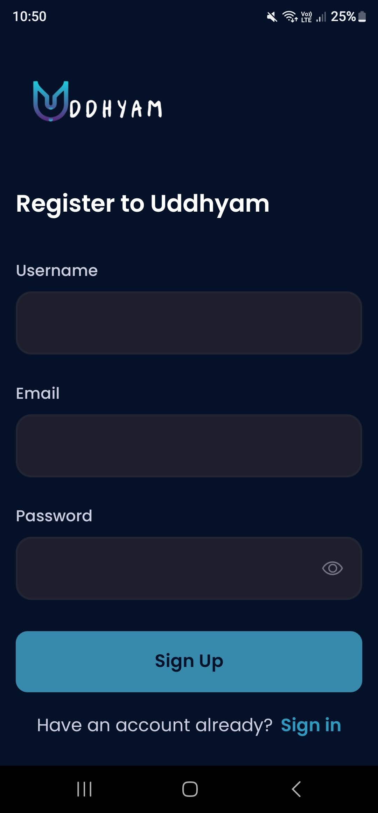
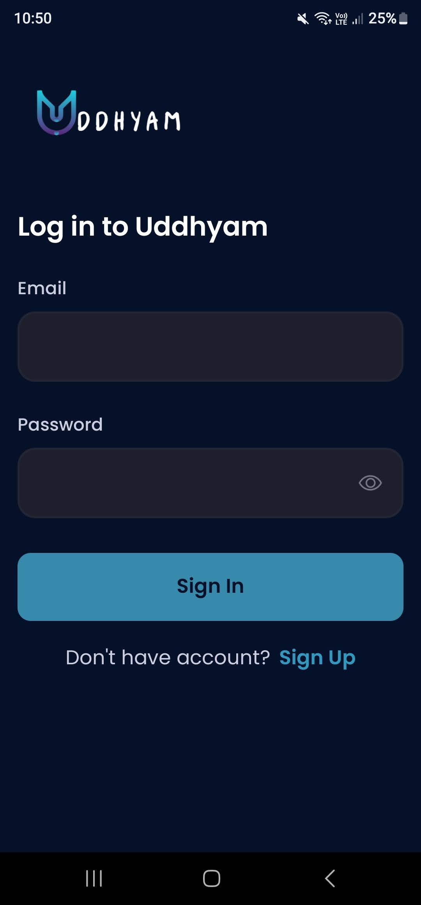
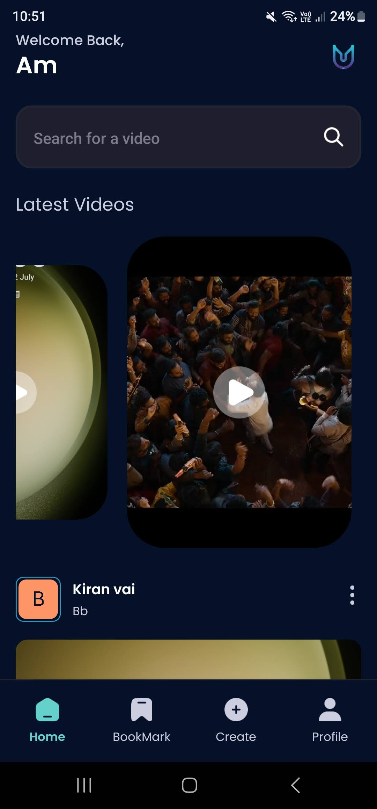
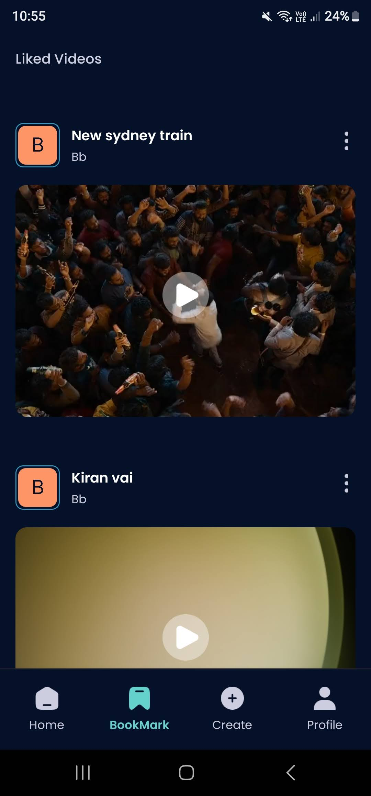
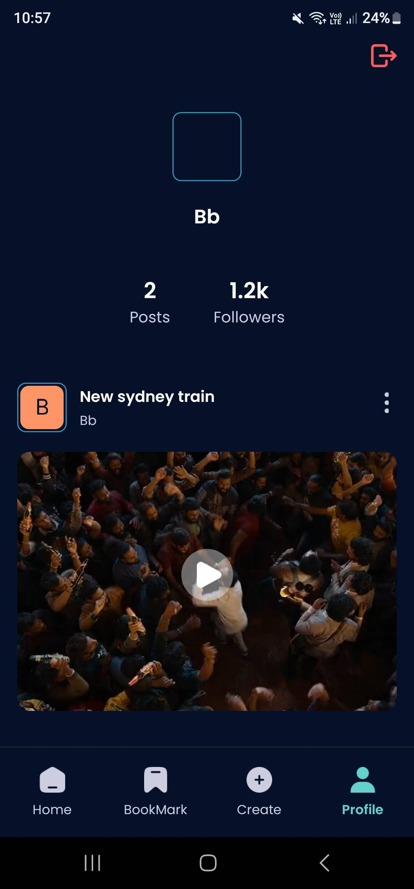

# Welcome to UDDHYAM

Welcome to my React Native project, "UDDHYAM". It's a video-sharing platform enabling users to register/login, upload videos, browse videos that others have uploaded, and save videos.

## Screenshots

### Landing, Register, and Login Pages

Here are the screenshots for the landing, register, and login pages of the app:

    
    
    

### Home and Save Pages

Below are the screenshots for the home and save pages:

    
    

### Create and Profile Pages

Finally, here are the screenshots for the create and profile pages:

    
    

